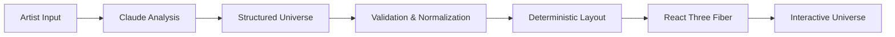

# SONORA

Your taste, mapped.

SONORA is an interactive music installation that happens to be a web application. Users enter the artists they love, and SONORA analyzes the musical relationships between them, turning that analysis into an explorable spatial universe. 

The application visually maps artists as stars, genres as regions, and recurring musical traits around a central "YOU" node, with unexplored musical territory appearing at the edge.

## The Experience

### Build your universe
Users enter 3 or more artists and analyze their selection. 

### Explore the universe
The application creates a persistent 3D spatial environment containing:
- YOU
- artists
- genres
- traits
- relationships
- discovery territories

### Music DNA
The universe can transform into a radial Music DNA view, showing observational, recurring characteristics generated from the selected music. 

### Explore the Unknown
SONORA identifies adjacent musical territories outside the current selection and lets the user explore uncharted regions to discover new artists.

### What if I add...
Users can add new artists to an existing universe. The celestial bodies shift, and the landscape rearranges around the newly added artist to represent your updated musical DNA.

## Why SONORA

SONORA is intentionally not a Spotify clone, a conventional recommendation feed, a chatbot, or a dashboard. 

Instead, it is a focused, interactive spatial representation of musical relationships, emphasizing atmosphere and exploration over generic UI components.

## How It Works



The server-side Claude analysis generates structured data (not UI or code), returning artist metadata, genres, traits, artist relationships, relationship explanations, and discovery territories.

A robust normalization layer ensures that:
- malformed references are removed
- missing values are defaulted or dropped entirely
- uncertain artists are treated conservatively
- rendered node and relationship counts are hard-capped for performance

## Tech Stack

| Category | Technology |
| :--- | :--- |
| **Frontend** | Next.js, React, TypeScript, Tailwind CSS |
| **3D & Rendering** | Three.js, React Three Fiber, Drei |
| **State & Motion** | Zustand, Framer Motion |
| **AI** | Anthropic Claude API, Anthropic TypeScript SDK |
| **Validation** | Zod |

## Architecture

* **`app/api/universe/` & `app/api/expand/`**: Server-only API routes executing Claude calls with structured output.
* **`lib/claude.ts`**: The Anthropic pipeline and caching layer.
* **`lib/universe.ts`**: The data contract and tolerant normalizer.
* **`lib/layout.ts`**: The deterministic layout algorithm ensuring consistent spatial generation.
* **`lib/choreo.ts` & `lib/motion.ts`**: The unified choreography logic governing all 3D transitions.
* **`components/scene/`**: The core React Three Fiber components.
* **`components/ui/`**: Minimal DOM overlays.

## Claude Integration

* Claude API calls happen entirely server-side. `ANTHROPIC_API_KEY` is never exposed to the browser.
* Structured output from the LLM is strictly validated using Zod.
* If a response is unusable, the server performs one stricter retry. 
* If analysis remains unusable, SONORA gracefully falls back to its offline reference universe.
* Repeated requests for the exact same artist list are served from an in-memory cache.
* `?offline` forces the offline/reference experience directly.

## Demo Mode

SONORA provides a reliable offline fallback for presentations without depending on a live Claude request. 

The reference universe defaults to **A.R. Rahman, Kishore Kumar, Lata Mangeshkar, Arijit Singh, and Shreya Ghoshal**. Adding **Sonu Nigam** to this setup is also supported entirely offline.

To force this mode safely during a live demo, append the query parameter:
`http://localhost:3000/?offline`

## Engineering Details

To keep the universe visually rich without allowing the WebGL scene to become unnecessarily expensive, SONORA enforces strict performance constraints:
- **Maximum 40 semantic rendered objects** 
- **~1200 particles** (hard cap)
- **Zero per-frame React state updates** (all high-frequency animation is handled via refs)
- **Deterministic layout** (avoids expensive physics simulations)
- **Persistent 3D scene**

## Interaction Design

All visual interactions follow a singular, unified motion language:

**FOCUS → CAMERA MOVE → SCALE / OPACITY → EMERGENCE → SETTLE**

These motion principles are reused across universe generation, node selection, Music DNA mode, discovery mode, and add-artist expansions. The UI philosophy prioritizes the celestial environment first, using restrained labels, deep negative space, and revealing relationships contextually rather than cluttering the screen with dashboard elements.

## Getting Started

```bash
git clone https://github.com/Aaryan-Sharma-5/sonora.git
cd sonora
npm install
cp .env.example .env.local
```

Populate your `.env.local` file with your credentials, then run the development server:

```bash
npm run dev
```

Open [http://localhost:3000](http://localhost:3000) in your browser.

## Environment Variables

| Variable | Required | Purpose |
| :--- | :--- | :--- |
| `ANTHROPIC_API_KEY` | Yes* | Required for live Claude analysis. *(Not required for demo/offline mode)* |
| `ANTHROPIC_WORKSPACE_ID` | Optional | Required only if your API key is scoped to a specific workspace. |
| `SONORA_MODEL` | Optional | Model override for the Claude API (defaults to `claude-opus-5`). |

## Development

```bash
npm run dev    # Start the development server
npm run lint   # Run ESLint
npm run build  # Create a production build
```

## Status

The core experience is complete and supports:
- Artist input parsing
- Server-side Claude analysis
- Reference/offline universe fallback
- 3D spatial exploration
- Music DNA extraction
- Discovery mapping (uncharted territories)
- Add-artist expansion 

## Design Principles

- Spatial over dashboard
- Relationships over lists
- Context over clutter
- Motion communicates meaning
- Data remains readable without overwhelming the scene
